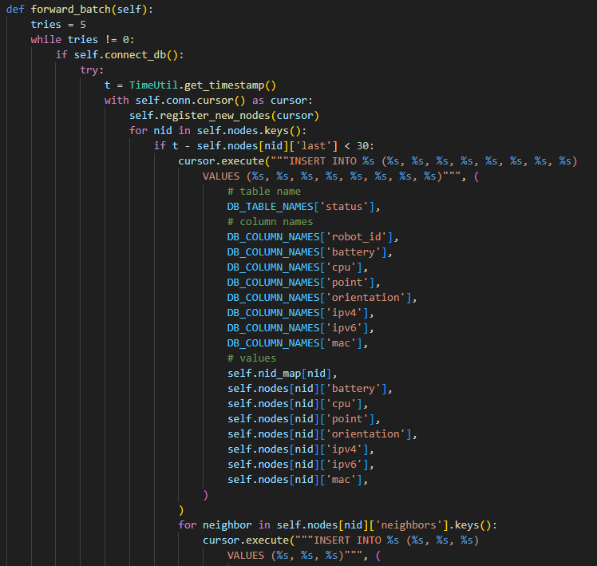

***Batman*** stellt sicher, dass sich unsere Roboter über ein Ad-hoc-Netzwerk verbinden und übernimmt das Routing. Jeder *Originator* (am Routing beteiligter Knoten) ist sich seiner Nachbarn bewusst.

***Docker*** containerisiert unsere Anwendung, lässt Container mit einander kommunizieren und ermöglicht den Betrieb eines Docker Swarms. In einem Docker Swarm können wir Services (praktisch nur Container) definieren, Replikationsstrategien festlegen und Container bzw. Services über verschiedene Hosts verknüpfen.

***ROS2*** macht aus den Hosts "Roboter", verbindet sie netzwerkweit (bei sleber `ROS_DOMAIN_ID`) über die RMW und führt ROS Nodes und ROS Services aus.

## Ich liefere...
***ROS2 Packages.*** Drei Packages `custom_interfaces`, `mock_robot` und `sw_robot`:
- `custom_interfaces` bietet Definitionen für Messages und Services für die anderen Packages. Momentan erhalten Services keinen Header und haben keine eindeutige Antwort wie vordefinierte Fehlercodes. Die grundlegende Funktionalität von *RobotServiceInfo*, verfügbare Services anzeigen zu lassen, ist zumindest bei benannten Services mit NID auf über das Backend möglich, da dieses sie mit `ros2 service list -t` anzeigen könnte. Dieser Service könnte die Ausgabe dafür filtern und gleichnamige Services, die von mehreren (aber nicht allen) Robotern angeboten werden, anzeigen. Zur Erklärung: Bei einem Service Call wird auf einen verfügbaren Service Server gewartet - von denen es mehrere geben kann.

- `mock_robot` beinhaltet den Mock-Roboter *MockRobotStatusPub*, sowie *BaseStatusPub* und weitere Utility. Batteriestand, CPU-Last der letzten Minute, MAC und IPv4 werden korrekt vom Host bestimmt (nur in VM und auf NUC getestet). Position, Drehung, Aktivität (bzw. State) und Nachbarn sind momentan noch Mock-Daten. Position und Drehung sollen von anderen ROS Nodes auf den jeweiligen Robotern bestimmt werden. Nachbarn können mit `batctl` bestimmt werden (das und Bestimmung der Signalstärke müssen noch umgesetzt werden). Eine Liste an möglichen Aktivitäten/Zuständen soll entweder der Datenbank der Datensenke oder einer Konfigurationsdatei (bspw. XML) entnommen werden.

- `sw_robot` beinhaltet den Data Sink *RobotStatusSub*, sowie *BaseStatusSub* und weitere Utility.

***Daten für die Datenbank.*** *RobotStatusSub* fügt alle 10 Sekunden den aktuellen Status aller mitgeführten Roboter ein, die sich in den letzten 30 Sekunden über ihre NID gemeldet haben. Wird die Aktivität/der Zustand geändert, wird sofort ein UPDATE auf der Tabelle *Robot* ausgeführt, wonach ein Trigger die Änderung in *StateChange* festhält. Hat sich ein Roboter seit mehr als 30 Sekunden nicht mehr gemeldet, werden für ihn keine Statusmeldungen mehr in die Datenbank eingetragen, da sie stets gleich sind. Das Backend kann mit `last_heard` des letzten Eintrags zu einem Roboter in der Tabelle *Status* selbst prüfen, wann sich ein Roboter das letzte Mal gemeldet hat.

Enthält eine Nachricht eine unbekannte NID im Header, wird im Data Sink in `self.nodes` zur NID als Schlüssel ein Dictionary als Wert gespeichert. Für die eingetroffene und jede zukünftige Nachricht mit dieser NID wird zum Schlüssel `last` ein UTC-Zeitstempel gespeichert und dem Nachrichtentyp entsprechend ein Wert aktualisiert - beispielsweise der Batteriestand.

Wird ein Batch in die Datenbank geschrieben, wird für jede aktuelle Node in `self.nodes` ein INSERT in die Tabelle *Status* ausgeführt. Davor werden für der Datenbank unbekannte NIDs Einträge in die Tabelle *Robot* erstellt und eine aktuelle Liste an Paaren aus NID und dazugehöriger `robot_id` geholt.

 

## Ich benötige...
- Verlangte ROS2 Services
- Ein Liste an Aktivitäten/Zuständen, die ein Roboter annehmen kann (sollte in DB oder XML gespeichert werden, danit Datensenke sie herausfinden kann; aber wie Roboter? String als Env, welche Aktivitäten mit Leer- oder Sonderzeichen trennt?)
- (später) Rollen oder Tags für Kriterien bei der Replikation von Docker Services in einem Docker Swarm (bspw. damit ein RaspberryPi nur bestimmte Aufgaben übernimmt)
- Merge-Strategie, falls zwei Netzwerke mit Data Sinks mergen (Konflikte mit URLs der Web-Server?)

## Backlog
- Launch Files und XML-Dateien oder ein ähnliches Format nutzen, um alles anpassbarer zu machen.
- Ausgabe der Nachbarn
  - Überlegen, wo und wann Nachbarn gepublisht werden sollen (falls Ermittlung der Signalstärke etwas braucht, sollte es nicht zu häufig geschehen und evtl. asynchron)
- Eine Struktur des Schwarms (Rollen oder Tags; wer Manager/Worker ist...) ausdenken
- Stress-Tests für synchrone Verarbeitung der Nachrichten