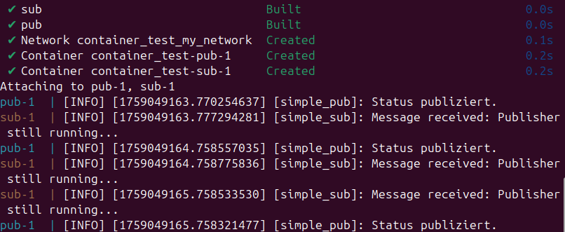

# Einleitung
In diesem Abschnitt soll anhand eines einfachen Beispiels gezeigt werden, wie ROS2 Packages erzeugt werden. Anschließend soll in Tests die Kommunikation zwischen ROS2 Nodes getestet werden.

Voraussetzungen:
    - Linux (hier Ubuntu 24.04)
    - eine ROS2 jazzy Installation und python3 oder `ros:jazzy` Docker Image
    - colcon
    - rosdep

Die Tests wurden auf einem privatem Laptop in einer VM und Intel-NUCs vom Institut für Elektromobilität der Hochschule Bochum durchgeführt. Für den NUC wurde das Docker Image `ros:jazzy` verwendet, welches alle Voraussetzungen erfüllt. Bei Verwendungs dieses Images müssen `colcon` und `rosdep` eventuell aktualisiert werden.

# ROS2 sourcen
Bei jedem Öffnen der Konsole muss `source /opt/ros/jazzy/setup.bash` ausgeführt werden. Alternativ kann dies mit `echo "source /opt/ros/jazzy/setup.bash" >> ~/.bashrc` automatisiert werden. Da hier die globale ROS2-Installation gesourct wird, nennt man sie das Underlay. Um Abhängigkeiten von Packages besser zu verwalten und Konflikte zu vermeiden, verwendet man üblicherweise ein Overlay. Dies ist eine paketspezifische Installation, welche vorausgesetzte Bibliotheken enthält.

Referenz: https://docs.ros.org/en/jazzy/Tutorials/Beginner-CLI-Tools/Configuring-ROS2-Environment.html

# Workspace einrichten
Dieses Package ist ein einfaches Beispiel zu ersten Testzwecken. Ziel ist es, ein einfaches Publisher-Subscriber-Modell umzusetzen und unter verschiedenen Bedienungen zu testen:
- Auf der selben Maschine
- In zwei Containern auf der selben Maschine
- In zwei Containern auf jeweils verschiedenen Maschinen

Das Verzeichnis `container_test/solarswarm` soll als Workspace dienen und Packages in einem Verzeichnis `src` liegen. In `src` erzeugt `ros2 pkg create --build-type ament_python --license Apache-2.0 --node-name simple_pub first_package` ein Package namens `first_package`, welches Python Code für seine Nodes verwenden soll. Stattdessen können Nodes auch in C implementiert und mit CMake gebaut werden. Die Tutorials der offiziellen Dokumentation bietet ein side-by-side für beide Varianten. Der Einfachheit wegen verwenden wir Python. `--node-name simple_pub` erzeugt bereits eine Node, die als Referenz hilft, das Package um weitere Nodes zu erweitern. `pkg create` stellt alle fürs Bauen des Packages notwendigen Dateien. Diese müssen jedoch angepasst und um funktionierende Python Skripte ergänzt werden. In der `package.xml` können bereits `<description>` und `<maintainer>` und in `setup.py` `maintainer`, `maintainer_email` und `description` gefüllt werden.

`colcon` und `rosdep` sind zwei grundlegende Tools, um ein Package zu bauen und Abhängigkeiten zu installieren. Von `solarswarm` aus kann mit `colcon build --packages-select first_package` das Package gebaut werden, doch macht es noch nichts. `colcon build` genügt zum Bauen, allerdings werden so alle vorhandenen Packages gebaut, wodurch der Prozess bei größeren Projekten länger dauert. Gebaut werden sollte nach jeder Änderung des Codes vor Tests.
`rosdep install -i --from-path src --rosdistro jazzy -y` installiert Abhängigkeiten aller Packages im Workspace. Diese müssen im Package mit ihrer eindeutigen Bezeichnung selbst angegeben werden. Abhängigkeiten können eingetragen werden, nachdem sie bei der Programmierung der Nodes festgestellt wurden.

Zur Ausführung sollte das Overlay mit `source install/local_setup.bash` gesourct werden.

Referenz: https://docs.ros.org/en/jazzy/Tutorials/Beginner-Client-Libraries/Creating-Your-First-ROS2-Package.html

# Publisher Node erstellen
`solarswarm/src/first_package/first_package` beinhaltet Python-Skripte für Nodes. `simple_pub.py` ist bereits vorhanden und beinhaltet nur eine einfache `print()`-Anweisung, die nun mit dem Publisher ersetzt wird. Anschließend wird in einer neuen Datei `simple_sub.py` der Subscriber umgesetzt.

Für einen Publisher wird eine Klasse benötigt, die von der Klasse Node aus dem Modul `rcl.node` erbt. Des Weiteren wird `rclpy` zur Ausführung und ein Nachrichtentyp benötigt. In `simple_pub.py` wurde eine möglichst einfache Implementierung umgesetzt. `simple_sub.py` beinhaltet eine einfache Implementierung eines Subscribers.

Anschließend müssen Abhängigkeiten der Python Module und Entrypoints angegeben werden.  
In `package.xml`:  
    `<exec_depend>rclpy</exec_depend>`
    und `<exec_depend>std_msgs</exec_depend>`
    bei den anderen `_depend` Tags

In `setup.py`:  
    Das Directory `entry_points` hat den Schlüssel `console_scripts`, zu dem eine Liste an Strings gehört. `'simple_pub = first_package.simple_pub:main'` ist bereits in der Liste, aber (mit Komma getrennt) muss `'simple_sub = first_package.simple_sub:main'` noch hinzugefügt werden.

Von `solarswarn` aus installiert `rosdep install -i --from-path src --rosdistro jazzy -y` die notwendigen Python Module. `colcon build --packages-select first_package` baut das Package.

Referenz: https://docs.ros.org/en/jazzy/Tutorials/Beginner-Client-Libraries/Writing-A-Simple-Py-Publisher-And-Subscriber.html

# Erster Test: Auf der selben Maschine
Zum Ausführen beider Nodes werden zwei Terminals benötigt, die jeweils das Overlay sourcen. Von der Wurzel des Workspaces aus erfolgt dies mit `source install/local_setup.bash`. Die Nodes werden mit `ros2 run <Name des Packages> <Name der Node>` gestarten. Hier:
- `ros2 run first_package simple_pub` in dem ersten Terminal
- `ros2 run first_package simple_sub` in dem zweiten Terminal

Der Test ist erfolgreich, wenn jede Sekunde das erste Terminal `Status gesendet.` und das zweite `Publisher still running...` ausgeben.

# Zweiter Test: In zwei Containern auf der selben Maschine
Als Image für die Docker-Container verwenden wir `ros:jazzy`. Mit `sudo docker pull ros:jazzy` kann es installiert werden. `sudo docker run -it ros:jazzy` startet einen Container mit interaktiver TTY. Das Image hat bereits eine ROS2 Distribution und `which colcon` bzw. `which rosdep` zeigen, dass `colcon` und `rosdep` vorinstalliert sind. Der Nutzer heißt hier `ubuntu`. Bei Verwendung anderer Images sollte geprüft werden, ob diese Tools vorhanden sind. Den Nutzernamen ist für absolute Pfade relevant - etwa in Dockerfiles.

## Einfache Dockerfiles ohne Netzwerk
Für den Test sollen zwei Dockerfiles `simple_pub_dockerfile` und `simple_sub_dockerfile` verwendet werden, um zwei Docker Images `simple_pub` und `simple_sub` zu generieren. Die Dockerfiles, dazugehörige Skripte zum Starten der ROS-Nodes und andere relevante Dateien sind im Verzeichnis `container_test` enthalten. Die Container sollen auf `ros:jazzy` basieren und eine Kopie von `container_test/solarswarm`, einem Init-Skript und `unzip.py` haben. Die gebauten Packages sind in `solarswarm/install` und können durchs Sourcen des Overlays verwendet werden. Es folgt der Inhalt und eine kurze Erklärung von `simple_pub_docker` und `pub_init.bash`. Beim Subscriber wird lediglich "pub" durch "sub" ersetzt.

```Dockerfile
    FROM ros:jazzy
    COPY solarswarm/ /home/ubuntu/solarswarm/
    COPY pub_init.bash /home/ubuntu/solarswarm
    COPY unzip.py /home/ubuntu/solarswarm
    WORKDIR /home/ubuntu/solarswarm
    SHELL ["/bin/bash", "-c"]
    # RUN ["rosdep", "update"]
    ENTRYPOINT ["bash", "pub_init.bash"]
```
```bash
    #!/bin/bash
    source /opt/ros/jazzy/setup.bash;
    # rosdep update;
    # rosdep install -i --from-path src --rosdistro jazzy -y;
    # colcon build --packages-select first_package;
    python3 unzip.py "install.zip"
    source install/setup.bash;
    ros2 run first_package simple_pub;
```

Die Notation mit eckigen Klammern wird von Docker empfohlen. Statt `ENTRYPOINT ["bash", "pub_init.bash"]` wäre auch `ENTRYPOINT bash pub_init.bash` erlaubt, würde aber eine Warnung beim Bauen ausgeben.

`SHELL ["/bin/bash", "-c"]` ist notwendig, damit der `source` Befehl funktioniert und `ros2` verwendet werden kann.
Lösung von Bruno Bronosky als Verbesserung zu Anubhav Sinhas Antwort. Referenz: https://stackoverflow.com/a/25423366

`first_package` soll im Container in `/home/ubuntu/solarswarm/src` liegen, damit es aus dem Verzeichnis `solarswarm` aus gebaut werden kann. Die Container werden in zwei unterschiedlichen Terminals gebaut mit
```bash
    sudo docker build --tag simple_pub -f simple_pub_dockerfile . # --tag simple_sub
```
und gestartet mit
```bash
    sudo docker run simple_pub # oder simple_sub
```

Ohne das Setzen von `SHELL` in der Dockerfile gelang es nicht, über `ENTRYPOINT` oder `CMD` das Skript vollständig auszuführen, da `source` nicht ausgeführt wurde und `ros2` der Shell unbekannt blieb. Die Funktionalität des Bash-Skripts befand sich zuvor in der Dockerfile, wurde aber verlagert, da es nur gelang, mit `sudo docker run -it simple_pub` innerhalb der laufenden Container das Skript auszuführen. Eine mögliche Erklärung dafür ist, dass unter Ubuntu `-i` standardmäßig `bash` verwendet wird, `CMD` und `ENTRYPOINT` von Docker hingegen `sh`. Mit `sudo docker run -it ros:jazzy` und anschließend `cat /etc/os-release` ließ sich prüfen, dass das Image `ros` zur Zeit des Tests (Mai 2025) auf Ubuntu 24.04.2 LTS basiert. Alternativ bietet ROS2 neben `.bash`-Setup-Dateien auch welche mit `.sh` an.

`simple_pub` sollte zuerst gestartet werden, da die Node `simple_sub` vom Publisher abhängt. Mit Docker Compose kann diese Abhängigkeit behandelt werden, damit `simple_sub` immer als letztes gestartet wird. Im Verlauf unseres Projekts werden wir uns darauf stützen, doch bei diesem kleinen Test reicht es, die Container manuell zu starten.
Sobald der Container `simple_pub` im ersten Terminal läuft, sollte nach kurzer Zeit kontinuierlich die Ausgabe `Status Publiziert.` erscheinen. Anschließend kann im zweiten Container im anderen Terminal der Subscriber gestartet werden. Die wiederholte Ausgabe `Publisher still running...` deutet an, dass sich die Nodes gefunden haben. Dies gelang auch ohne ein nutzerdefiniertes Docker-Netzwerk.

## Docker-Compose mit Netzwerk
Docker bietet verschiedene Netzwerktreiber, um Container miteinander zu verbinden. Netzwerke und daran angeschlossene Container lassen sich übersichtlich in einer YAML-Datei für Docker-Compose beschreiben. Für den Test auf einem Host verwenden wir den Standard Netzwerktreiber `bridge`. Für den Test über verschiedene Hosts werden wir den `overlay`-Treiber verwenden, da dieser Docker daemons miteinander verbindet. 
Quelle: https://docs.docker.com/engine/network/


Für die YAML-Datei können die Dockerfiles des vorherigen Versuchs verwendet werden. Sie sieht wie folgt aus:
```
    services:
            simple_pub:
                build: ./simple_pub_dockerfile
                networks:
                    - my_network
                # tty: true
                # stdin_open: true
            simple_sub:
                build: ./simple_sub_dockerfile
                networks:
                    - my_network
                # tty: true
                # stdin_open: true
        networks:
            my_network:
                driver: bridge
```

Eingabe im Terminal:
```bash
    sudo docker compose up
```




# Dritter Test: In zwei Containern auf verschiedenen Maschinen (nicht durchgeführt)
> Overlay networks are often used to create a connection between Swarm services, but you can also use it to connect standalone containers running on different hosts. When using standalone containers, it's still required that you use Swarm mode to establish a connection between the hosts.
Referenz: https://docs.docker.com/engine/network/drivers/overlay/

Ähnlich wie beim letzten Versuch soll als nächstes ein Netzwerk über zwei Maschinen manuell mit `sudo docker network create -d overlay my_network` erstellt werden. Eine Maschine führt den Publisher-Knoten mit `sudo docker run --network=my_network -it pub` und die andere den Subscriber-Knoten mit `sudo docker run --network=my_network -it sub` aus.