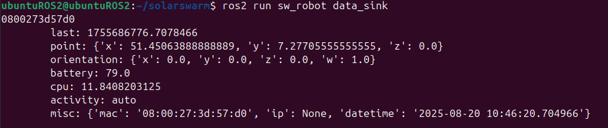

# Mock-Roboter
## Übersicht
Das ROS2 Package `mock_robot` soll Ziel /Z70/ im Pflichtenheft erfüllen. Mock-Roboter sind ROS2 Nodes, die auf Nicht-Robotern gestartet werden können, um Roboterprozesse zu simulieren. Das Package soll eine einzige Node implementieren, die Mockdaten für Tests liefert, darunter: Batteriestand, Aktivität, CPU-Last (über Intervalle gemittelt), Position, Orientierung, Adressen und Nachbarn mit Verbindungsstärke. Aus dem Mock-Roboter wurden Anforderungen an Roboter-Statusmeldungen (BaseStatusPub) und eine Datensenke (BaseStatusSub) abgeleitet.

## Rekonstruktion
Zur Erstellung der Packages `mock_robot` wurde wird sich an den Schritten aus dem Kapitel **first_package** orientiert. Für die verschiedenen Mockdaten werden Message Interfaces benötigt. Da die Daten auf verschiedenen Topics gepublisht werden sollen, genügen die vordefinierten Interfaces aus `example_interfaces` und `geometry_msgs`. Diese werden ab Version 0.7.0 durch `custom_interfaces` v0.1.0 Interfaces ersetzt, welche zusätzlich das Feld `nid` als String zur einfachen Identifizierung des Publishers haben. Ab Version 0.10.0 enthalten Nachrichten aus `custom_interfaces` v0.3.0 ein Feld `header`, welches die `nid` und zusätzliche Metainformationen enthält. Die NID wird momentan aus der MAC einer Hostmaschine ohne `:` bestimmt. Um dies zu ändern, kann `get_nid()` in `util/robot_util.py` verändert werden. Bei dem Gebrauch einer Hashfunktionen ist darauf zu achten, dass der resultierende Hash keine Sonderzeichen auaßer `_` enthält und Abhängigkeiten berücksichtigt werden. Diese Einschränkung ergibt sich dadurch, dass mit der NID Namen für Nodes und Services konstruiert werden, welche nicht alle Zeichen zulassen. Bei der Suche nach einem geeignetem Algorithmus und Modul ist weiter zu beachten, ob der rosdep-Schlüssel im Index vorhanden ist, da das Modul sonst manuell installiert werden muss.

Der Batteriestand und CPU-Last lassen sich als Floats und Aktivität und Misc als String darstellen. `example_interfaces` bietet für diese Datentypen die Interfaces *String* und *Float64*. Die offizielle Dokumentation des Packages empfiehlt, diese nur für Tests zu verwenden und eigene Interfaces fürs Deployment zu definieren. Daher implementiert `custom_interfaces` *RobotBattery*, *RobotCpu*, *RobotActivity* und *RobotMisc*. Für die Position und die Orientierung bietet das Package `geometry_msgs` das Message Interface *Pose*, welches aus einem *Point* und einem *Quaternion* (Vektor mit Skalar) besteht, sowie *Header*. Auf Wunsch der betreuenden Lehrperson wird Pose nicht verwendet. *RobotPoint* und *RobotQuaternion* erweitern die Interfaces *Point* und *Quaternion* um *Header*. Dabei handelt es sich um eine Variante von *std_msgs/msg/Header* mit `nid` und einer Variante von *std_msgs/msg/Time* mit 64-bit Feldern. *NeighborList* beinhaltet die Listen `neighbors` (Strings) und `indicators` (64-bit Floats). Ein Roboter führt in diesen alle ihm sichtbaren Nachbarn mit ihrer Signalstärke auf. Dabei entspricht `indicators[i]` der Signalstärke zu `neighbors[i]`, bestimmt durch "signal avg" aus `iw dev <wlan dev> station dump`.

Das Package `mock_robot` wurde mit dem Befehl
```bash
    ros2 pkg create --build-type ament_python --license Apache-2.0 --node-name mock_data mock_robot --dependencies rclpy rcl_interfaces example_interfaces geometry_msgs python3-psutil
```
erstellt. Es hat nach Erzeugung bereits `mock_data` und alle notwendigen Dateien. Hier angegebene Abhängigkeiten werden der `package.xml` automatisch hinzugefügt, jedoch müssen Angaben über Maintainer, Description und Version in `package.xml` und `setup.py` anktualisiert werden. Es sei zu beachten, dass `--dependencies` `<depend>`-Tags generiert, welche eine Abhängigkeit fürs Bauen und Ausführen beschreibt. Für Python-Module ist ersteres überflüssig, weswegen die Verwendung von `<exec_depend>`-Tags empfohlen wird. In `mock_robot/mock_robot/mock_data.py` wurde die Funktionalität der Node implementiert. Ab `mock_robot` v0.9.0 wurden Basisfunktionalitäten, die auch für Roboter relevant sind, entkoppelt.

Zur Bestimmung der CPU-Last und Batterie wird das Python-Modul `psutil` verwendet, welches die Messung abstrahiert und betriebssystemunabhängig macht, solange das ausführende Betriebssystem unterstützt wird. Die Dokumentation des Moduls beinhaltet eine akutelle Liste aller unterstützten Betriebssysteme und Python Versionen. Unter "System related functions" sind die für die Node verwendeten Funktionen `getloadavg` und `sensors_battery` dokumentiert. Der Eintrag zu `getloadavg` beinhaltet ein Beispiel, wie die Funktion für nützliche Werte verwendet wird. 

Referenz: https://psutil.readthedocs.io/en/latest/

Zur Bestimmung der IP-Adresse wird das Python-Modul `socket` verwendet, basierend auf einem geeksforgeeks-Beitrag
```python
    data["ip"] = gethostbyname(gethostname())
```
Referenz: https://www.geeksforgeeks.org/python/python-program-find-ip-address/

Zur Bestimmung der MAC-Adresse wird eine Regular Expression aus einem geeksforgeeks-Beitrag verwendet:
```python
    data["mac"] = ':'.join(re.findall('..', '%012x' % uuid.getnode()))
```
Referenz: https://www.geeksforgeeks.org/python/extracting-mac-address-using-python/


## Verwendung
### Vorbereitung
Das Projekt beinhaltet neben dem Source Code in `ros2_packages_src` auch Workspaces mit den Packages `mock_robot`, `data_sink` und `custom_interfaces` in `ros2_workspaces/`. In `ros2_workspaces/` sind komprimierte Verzeichnisse mit Kopien dieser Packages, sowie weiteren Dateien zum Einrichten und Testen auf Robotern. Darunter sind Dockerfiles und Docker-Compose-Dateien, mit denen Images angefertigt werden können. Das initiale Bauen der Images erfordert eine Internetverbindung. Sollten Änderungen vorgenommen oder die Packages aus anderen Gründen neu gebaut werden müssen, ist ebenfalls eine Internetverbindung erforderlich. `mock_robot` und `data_sink` hängen beide von `custom_interfaces` ab. Das manuelle Installieren der Äbhängigkeiten und Bauen der Packages erfolgt mit:
```bash
    rosdep install -i --from-path src --rosdistro jazzy -y
    colcon build [--packages-select <Package> [<weiteres Package>]]
```
Ist durch Modifikationen an diesem Package die Installation weiterer Packages oder Python-Module notwendig, müssen ihre entsprechenden rosdep Schlüssel der `package.xml` des relevanten Packages hinzugefügt werden. Generell finden Änderungen in `src` statt und erfordern, das betroffene Packages neu gebaut werden.

Zur rosdep Namensauflösung: https://docs.ros.org/en/jazzy/Tutorials/Intermediate/Rosdep.html#how-do-i-know-what-keys-to-put-in-my-package-xml

### Start des Mock-Roboters
Wurde der Mock-Roboter als ROS2 Node gebaut, kann er mit `ros2 run mock_robot mock_data` manuell gestartet werden. Zur Laufzeit wird mit `ros2 node list` die Node als `mock_robot_status_pub_<nid>` angezeigt. Sie verfügt über die drei Parameter `system_intervall` (default 3.0), `geo_intervall` (default 3.0) und `misc_intervall` (default 20.0), welche bestimmen, wie häufig Timer-Callback-Funktionen Nachrichten veröffentlichen. Da die Timer bei start der Node initialisiert werden, müssen die Parameter zur Launch-TIme festgelegt werden.

Diese Tabelle stellt die Zugehörigkeit der geforderten Topics zu ihren Interfaces und den drei Timern dar:

| Topic | Interface | Gruppe | Bedeutung |
|-------|-----------|--------|-----------|
| robot_battery | RobotBattery | system | Batteriestand data in % zwischen 0.0 und 100.0 oder gleich -1.0 (falls keine Informationen vorhanden sind) als 64-bit float |
| robot_cpu | RobotCpu | system | Durchschnittliche CPU-Last data aller Kerne in der letzten Minute in % zwischen 0.0 und 100.0 als 64-bit float |
| robot_activity | RobotActivity | system | Aktuelle Aktivität als String: 'auto' (Mock-Roboter fährt Route ab) 'manual' (Punkt wird angefahren), 'idle', 'recharge' |
| robot_point | RobotPoint | geo | Drei Koordinaten x, y und z als 64-bit floats |
| robot_orientation | RobotQuaternion | geo | Vier Werte x, y, z, w als 64-bit floats |
| robot_misc | RobotMisc | misc | IPv4, IPv6 und MAC als Strings |
| neighbors | NeighborList | geo | Liste an NIDs von Nachbarn und parallele Liste an Indikatoren (ein float je Nachbar; Einheit `dBm`) für die Verbindungsqualität |

Die Nachrichten auf diesen Topics können mit `ros2 topic echo <Topic>` abgehört oder mit Subscriptions, die mit entsprechenden Message Interfaces lauschen, verarbeitet werden. Das Package `sw_robot` implementiert eine Node `data_sink`, welche Scubscriptions für die oben genannten Topics implementiert und kann dazu als Vorlage diesnen. Ein Beispiel wird später zur Erläuterung der Node gezeigt.

Die folgenden Services des Mock-Roboters können mit `ros2 service call` oder durch einen Service Client aufgerufen werden. Felder werden dabei als JSON-String gefüllt, insofern eine Eingabe erforderlich ist:

| Service | Interface | Beschreibung |
|---------|-----------|--------------|
| set_robot_activity_`nid` | SetRobotActivity | `activity` erhält einen Bezeichner für eine zu setzende Aktivität und je nach Aktivität zusätzliche Details. Momentan erlaubt: 'auto' fährt eine Route ab (Routen-Index in `details`), 'manual' fährt einen Punkt an und wird dann 'idle' (Koordinaten als JSON-String in `details`), 'recharge', 'idle'. `msg` teilt mit, ob die Änderung gelungen ist.|
| robot_service_info_`nid` | RobotServiceInfo | `service` erhält einen leeren String oder String bestehend aus alphanumerischen Zeichen, '/' und '_'. `services` enthält eine Liste aus Strings, welche verfügbare Services mit Typ getrennt durch ein Leerzeichen beinhalten (Beispiel: `/set_robot_activity_A81835345312 [custom_interfaces/srv/RobotActivity]`). Ist `service` nicht leer, wird die Liste mit dem Eingabestring gefiltert. Das erste Wort von `msg` ist 'Success' oder 'Failure'. 'Success' schließt jedoch nicht aus, dass keine Services gefunden wurden (betrachte stattdessen Länge der Liste). | 
| robot_interface_info_`nid` | RobotInterfaceInfo | `interface` erhält einen leeren String oder Bezeichnung für ein Interface. Wenn es ein solches Interface gibt, wird die Definition in `definition` zurückgegeben (`interfaces` bleibt leer). Ansonsten wird eine Liste aller Interfaces in `interfaces` zurückgeblieben (`definition` bleibt leer). |

### Übersicht der Interfaces
| Header | Time |
|--------|------|
| string nid | int64 sec |
| string frame_id "" | |
| Time time | |

| RobotBattery | RobotCpu | RobotActivity | RobotPoint | RobotQuaternion | RobotMisc | NeighborList |
|--------------|----------|---------------|------------|-----------------|-----------|--------------|
| Header header | Header header | Header header | Header header | Header header | Header header | Header header |
| float64 data | float64 data | string activity | float64 x | float64 x | string ipv4 | string[] neighbors
| | | | float64 y | float64 y| string ipv6 | float64[] indicators |
| | | | float64 z | float64 z| string mac | |
| | | | | float64 w | | |

| SetRobotActivity | RobotServiceInfo | RobotInterfaceInfo |
|------------------|------------------|--------------------|
| string activity | string service "" | string interface "" |
| string details | --- | --- |
| --- | string msg | string definition |
string msg | string[] services | string[] interfaces |

In Python-Nodes werden Interfaces wie Klassen behandelt. Ihre Namen entsprechen dem Dateinamen ohne Endung. Beispielsweise wird das Interface aus `msg/RobotBattery.msg` wie folgt importiert:
```python
    from custom_interfaces.msg import RobotBattery

    # Eine Nachricht (etwa in einer Timer-Callback-Funktion) wird über den Konstruktor der Klasse erstellt
    msg = RobotBattery()
    # Felder können wie Attribute einer Klasse gefüllt werden
    msg.header.nid = self.nid
    msg.data = Util.get_battery()
    msg.header.time.sec = get_timestamp()
    # Über ein Publisher-Objekt kann mit publish(msg) eine Nachricht veröffentlicht werden
    self.getPublischer('battery').publish(msg)
```

Services werden auf ähnliche Weise importiert, jedoch werden Antworten auf Service Calls mit einem `return` der Service-Callback-Funktion veröffentlicht:
```python
    from custom_interfaces.srv import RobotServiceInfo

    # Ein Methoden-Kopf erhält (neben self) zwei Parameter, üblicherweise request und response
    # Folgender Methoden-Kopf ist Teil der Klasse BaseStatusPub:
    def service_info_callback(self, request, response):
        # Auf die Felder kann wie auf Attribute zweier Objekte zugegriffen werden
        print(request.service)
        response.msg = 'dummy'
        return response # Antwort
```

Aus Tests mit der Python built-in-Funktion `type()` geht hervor, dass `request` und `response` zwei verschiedenen Klassen angehören. In diesem Fall haben sie die Klassennamen (mit `type(request).__name__`) *RobotServiceInfo_Request* und *RobotServiceInfo_Response*. Wegen der Umsetzung der Interfaces als Klassen, lässt sich zu diesen ein Klassendiagramm zeichnen:


## Klasse MockRobotStatusPub
Der Mock-Roboter ist eine ROS2 Node `mock_data`. Implementiert wird diese als Klasse *MockRobotStatusPub* in `mock_robot/mock_robot/mock_data.py`, welche von *BaseStatusPub* und *MockPosition* erbt.


*MockRobotStatusPub* implementiert drei Timer (Intervalle durch Parameter übergeben) mit entsprechenden Timer-Callback-Funktionen. Diese veröffentlichen Nachrichten auf den oben genannten Topics. Die genannten Publishers und Services werden im Konstruktor der Oberklasse *BaseStatusPub* erstellt. Die Service-Callback-Funktionen müssen jedoch in *MockRobotStatusPub* überschrieben werden. Für Publishers, Services, Actions und Timers werden mehrere Dictionaries angelegt. Die Schlüssel der erstellten Publishers und Services entsprechen ihren Bezeichnungen ohne `'robot'`: battery, cpu, activity, point, orientation, misc, neighbors, set_activity, service_info, interface_info (als Strings).

*MockPosition* simuliert die Bewegung auf einer von drei Formen: Entlang einer Linie, eines Dreiecks oder eines Vierecks. Die Formen sind eine Liste aus zwei bis vier Koordinaten, gespeichert als Vektoren aus dem Modul `numpy` in `points`. `points` ist eine zufällig aus `mock_routes` gewählte Liste. Das Modul `numpy` erlaubt das Rechnen mit Vektoren. Eine Position `current` läuft schrittweise auf einen Punkt in `points` zu und hält dabei eine maximale Schrittweite `max_vec_len` ein. `goal` ist der Index des anzustrebenden Punktes in `points`.
Der Geo-Timer-Callback in *MockRobotStatusPub* entscheidet, dass bei `activity == 'Working'` nach erreichen eines Zielpunktes der nächste (oder erste, falls am Ende von `points`) angestrebt werden soll und bei `activity == 'MoveToPoint'` in `'Idle'` gewechselt wird. Bei `activity in ('Idle', 'Charging')` 
ändert sich die Position nicht.

*Util* hat mehrere statische Methoden, die Systeminformationen wie Batteriestand oder MAC-Adresse bestimmen.

Durch die Verwendung der Dekoratoren `@property` (Getter) und `@<Property>.setter` (Setter) werden Attribute gekapselt. Listen und Dictionaries ohne Setter können nicht ersetzt, ihre Elemente aber manipuliert werden. Setter prüfen Parameter, melden aber nicht, wenn ein Wert nicht geändert wurde. Nur der Setter von Points erzeugt ein `ValueError`. Ab v0.13.0 kann auf die meisten Dictionaries und Sets nicht mehr direct zugegriffen werden. Stattdessen  holen Getter Kopien und manipulieren Setter die Datenstrukturen.

Methoden:
- @activity.setter activity(a) - `a` muss in allowed_activities sein.
- @points.setter points(p) - `p` muss eine nicht leere Liste mit Objekten der Klasse `numpy.ndarray` sein. Die Länge des Arrays und der Typ seiner Elemente  müssen mit denen in `points` übereinstimmen.
- @goal.setter goal(g) - `g` muss ein valider Index von points sein.
- @max_vec_len.setter max_vec_len(m) - `m` muss ein positiver Float sein.
- @current.setter current(a) - `a` muss ein Objekten der Klasse `numpy.ndarray` sein. Die Länge des Arrays und der Typ seiner Elemente müssen mit `current` übereinstimmen.
- set_activity_callback(request, response) - Ausgelöst durch den Service *SetRobotActivity*. Erhält eine gültige, vordefinierte Aktivität aus `('Working', 'Idle', 'MoveToPoint', 'Charging')` und antwortet, ob `activity` erfolgreich gesetzt wurde. Für `'MoveToPoint'` wird versucht, Koordinaten aus einem JSON-String in `details` zu lesen und `points` mit diesem einen Punkt zu überschreiben. Für `'Working'` wird versucht, einen Index aus `details` für `mock_routes` zu lesen.
- system_timer_callback() - Ermittelt sequentiell Batteriestand und durchschnittliche CPU-Last der letzten Minute. Beide Daten und die Aktivität werden auf ihren jeweilen Topics veröffentlicht. Ein negativer Wert für den Batteriestand deutet an, dass dieser nicht ermittelt werden konnte.
- geo_timer_callback() - Berechnet anhand `current`, `points`, `goal` und `max_vec_len` einen neuen Vektor für `current` und veröffentlicht diesen. Für die Orientierung werden die Default-Werte von *geometry_msgs.msg.Point* veröffentlicht.
- misc_timer_callback() - Veröffentlicht IP-Adressen und MAC-Adresse.
- createPublish(key, cls, topic, queue) - Versucht, einen Publisher in __publisher_dict mit dem Schlüssel `key` anzulegen. Queue ist per default 10. Ein zurückgegebener Boolean gibt wieder, ob der Publisher angelegt wurde.
- createService(key, cls, service_name, callback) - Versucht, einen Service in __service_dict mit dem Schlüssel `key` anzulegen. Ein zurückgegebener Boolean gibt wieder, ob der Service angelegt wurde.
- createAction(key, cls, action_name, callback) - Versucht, einen Action Server in __action_dict mit dem Schlüssel `key` anzulegen. Ein zurückgegebener Boolean gibt wieder, ob der Action Server angelegt wurde.
- createTimer(key, sec, callback) - Versucht, einen Timer in __timer_dict mit dem Schlüssel `key` anzulegen. Ein zurückgegebener Boolean gibt wieder, ob der Timer angelegt wurde.
- updateAllowedActivities(items) - Versucht, eine Liste/ein Set an Aktivitäten/States zu __allowed_activities hinzuzufügen.

> Hinweis: Getter und Setter werden implizit aufgerufen. Innerhalb der Klasse: `temp = self.activity` und `self.activity = 'Idle'`.  
> Warnung: Aktuell werfen Setter keine Fehler, falls das Setzen eines Werts fehlgeschlagen ist. `points` kann jedoch `ValueError` erzeugen.


## Die Klasse RobotStatusSub
Der Data Sink ist eine ROS2 Node `data_sink`. Implementiert wird diese als Klasse *RobotStatusSub* in `sw_robot/sw_robot/data_sink.py`, welche von der Klasse *BaseStatusSub* erbt.


*RobotStatusPub* implementiert einen Timer (Intervall durch Parameter übergeben) mit entsprechender Timer-Callback-Funktion. Diese schreibt batchweise alle Zustände der bekannten Roboter in eine Datenbank (`forward_batch`) oder gibt sie aus (`forward_batch_test`). `__batch_timer` (`batch_intervall` default 10.0) ruft `batch_timer_callback` auf, welcher `forward_batch` (`_test`, falls die Umgebungsvariable `FORWARD_TO_DB` leer) aufruft und einen Zeitstempel ausgibt. `subscription_callback` wird von allen Subscriptions aufgerufen und nimmt eine Fallunterscheidung für die Klasse der Nachricht vor. `__nodes` beinhaltet die `nid` einer Node als Schlüssel und ein `dict` mit dem Status des Roboters als Wert. Die Schlüssel-Werte-Paare sind `'battery'`, `'cpu'`, etc.. `check_nid` prüft, ob die `nid` einer Nachricht in `nodes` vorhanden ist. Falls nicht, wird ein Eintrag mit leerem Daten-`dict` erstellt.
*BaseStatusPub* definiert `forward_batch` und die Callback-Funktionen, jedoch müssen jedoch überschrieben werden. `connect_db` versucht, bei fehlender oder geschlossener Verbindung zu einer Datenbank, eine neue Verbindung aufzubauen. Dazu werden die Umgebungsvariablen `DB_NAME`, `DB_USER`, `DB_PASSWORD`, `DB_HOST` und `DB_PORT` abgefragt. Die Methode gibt `True` zurück, falls zuletzt eine gültige Verbindung besteht. Es ist nicht ausgeschlossen, dass die Verbindung nach dem Check abbricht, weswegen Operationen auf der Datenbank weiterhin mit try-catch-Blöcken abgesichert werden sollten. *RobotStatusSub* versucht in `forward_batch` mehrmals, eine Verbindung aufzubauen mit je einer Sekunde Pause zwischen Versuchen. Ist die für das Einfügen einer Statusmeldung in die Datenbank benötigte `robot_id` einer Node nicht in `__nid_map` vorhanden, meldet `register_new_nodes` zuerst neue Roboter in der Datenbank an und holt sich eine aktuelle Liste. Die Umgebungsvariablen `DB_TABLE_NAMES_*` und `DB_COLUMN_NAMES_*` können an die zugehörige Datenbank angepasst werden.

Beispielhafte Ausgabe einer Node durch `forward_batch_test`:



`check_nid` prüft, ob die NID im Header einer Nachricht bekannt ist und legt bei Bedarf einen Eintrag in `__nodes` an. Die Funktion definiert folgende Struktur einer Node in Form eines dict:
```python
    # Ausschnitt aus check_nid
    self.nodes[nid] = {
        'battery': ?, # None | float
        'cpu': ?, # None | float
        'activity': ?, # None | str
        'point': {'x': ?, 'y': ?, 'z': ?}, # None | mehrere floats
        'orientation': {'x': ?, 'y': ?, 'z': ?, 'w': ?}, # None | mehrere floats
        'ipv4': ?, # None | str
        'ipv6': ?, # None | str
        'mac': ?, # None | str
        'neighbors': {?: ?} # leer oder <str>:<float> für neigbor und signal quality
        'last': ?, # None | int
    }
```


## Datenfluss
Im folgenden Abschnitt soll auf den Zusammenhang der Netzwerkkomponenten eingegangen werden. Zunächst sei diese Abbildung zu betrachten:


Grundlegend für den Verkehr von ROS2 Nachrichten ist die ROS Middleware (RMW). Sie basiert laut ROS2 Dokumentation auf dem Industriestandard DDS/RTPS (Data Distribution Service/Real-Time Publish-Subscribe Protocol), welcher für die Entdeckung von Knoten und die Serialisierung, sowie den Transport von Daten zuständig ist. Wir verwenden per Standardkonfiguration von ROS2 Jazzy eProsimas Fast DDS aufgrund der Apache 2 Lizenz.

Referenz: https://docs.ros.org/en/jazzy/Concepts/Intermediate/About-Different-Middleware-Vendors.html

Entdeckung (eng. discovery) ist dafür verantwortlich, dass sich Publisher, Subscriber, Service Clients, Service Server und sonstige Teilnehmer im ROS Graphen erkennen. Sie geht über das eigene Betriebssystem oder in unserem Fall den eigenen Container hinaus und erkennt alle erreichbaren Teilnehmer im Netzwerk mit der selben `ROS_DOMAIN_ID`.

In der angeführten Abbildung dargestellt sind zwei Roboter, die sich im selben Netzwerk befinden. Die gestrichelten Pfeile deuten auf den Fluss einer Nachricht einer Publisher Node in Container A1 (Roboter A, Container 1). Jeder Fluss wird hier als eigener Fall betrachtet. In jedem Fall wird davon ausgegangen, dass die Discovery der RMW gelingt. Alle Container basieren auf dem Image ros:jazzy und haben somit ROS2 Jazzy installiert.

**Im ersten Fall** befindet sich der Subscriber in Container A1. Da sich beide ROS2 Nodes im selben Container befinden, wird kein Netzwerk benötigt. Die Nachricht kommt unmittelbar über die RMW an.  
**Im zweiten Fall** befindet sich der Subscriber in Container A2. Die Container 1 und 2 von Roboter A müssen über ein Netzwerk verbunden werden. Docker verbindet Container standardmäßig über ein Bridge-Netzwerk, welches üblicherweise für Container auf dem selben Host verwendet wird.  
**Im dritten Fall** befinden sich Subscriber und Publisher auf verschiedenen Robotern. Um die jeweiligen Container A1 und B1 zu verbinden, wird ein Overlay-Netzwerk benötigt, was die Teilnahme beider Docker daemons in einem Docker-Schwarm voraussetzt. Die Übertragung der Nachricht findet dann über WLAN statt.

Laut offizieller Docker Dokumentation sind Container von den Netzwerken des Hosts isoliert. Für batman-adv ist es daher möglich, dass `host` anstatt `overlay` als Netzwerktreiber für Docker Netzwerke benötigt werden.

Referenz: https://docs.docker.com/engine/network/