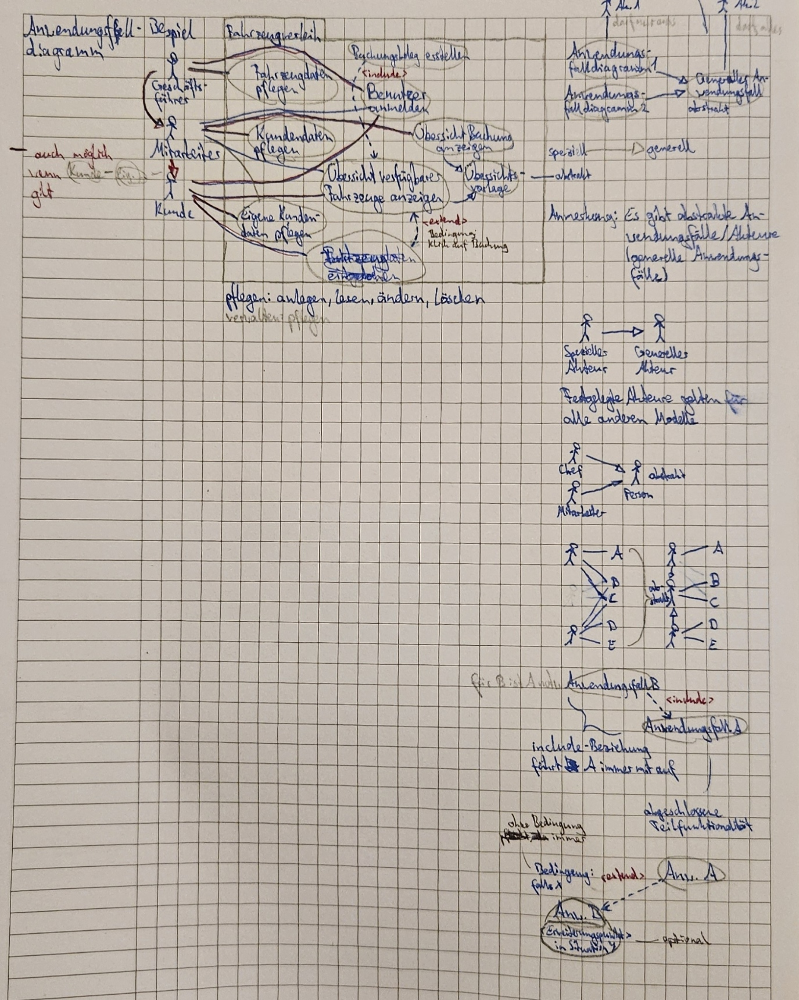
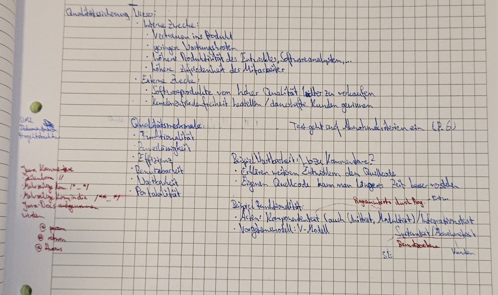

# Zu erledigen
- Lasten-/Pflichtenheft schreiben
- Use-Case Diagramm zeichnen
- Meilensteine planen (auch nachträglich eintragen)

## Was kennen wir?
### Diagramme
- Anwendungsfalldiagramm (Akteure und Anwendungsfälle)
- Aktivitätsdiagramm (Partitionen, Signale, etc.)
- Klassendiagramm
- Sequenzdiagramm (senkrechte Lebenslinien, zeitliche Abläufe, Methodenaufrufe, etc.)

### Design Patterns (OOP, nicht vorausgesetzt für SOP)
- Model View Control (MVC)
- Fabrik-Methode
- Singleton
- Observer

### Versionierung
Beispiel: 3.2.5-0196
> 3 -> Hauptversionsnummer (signifikante Änderung)  
> 2 -> Nebenversionsnummer (Erweiterungen)  
> 5 -> Revisionsnummer (Fehlerbehebungen)  
> 0196 -> Buildnummer (Fortschritt, Anzahl Kompilierungen)  

### Qualitätssicherung
- Kommentare
- (Formaler Pseudocode)
- Tests (Unit-Tests)
- Testfälle finden (Anwendungsfälle, Äquivalenzklassentests, Grenzwertbetrachtung)
- SOLID
    - Single Responsibility Principle
    > Jede Klasse sollte eine strikt abgegrenzte Verantwortlichkeit haben
    - Open Closed Principle
    > Ein Modul, eine Klasse, eine Methode sollen offen für Erweiterungen sein, aber geschlossen gegen Modifikationen
    - Liskov Substitution Principle
    > Unterklassen sollen anstelle ihrer Oberklassen einsetzbar sein (sie müssen sich so verhalten, dass jemand, der meint, ein Objekt der Oberklasse vor sich zu haben, nicht durch unerwartetes Verhalten überrascht wird)
    - Interface Segregation Principle
    > Große Schnittstellen sollen in mehrere kleinere Schnittstellen aufgeteilt werden, falls implementierende Klassen ansonsten unnötige Methoden haben müssen
    - Dependency Inversion Principle
    > Module höherer Ebenen sollen nicht von konkreten Implementierungen aus Modulen niedriger Ebenen abhängen (sondern beide von Abstraktionen)

