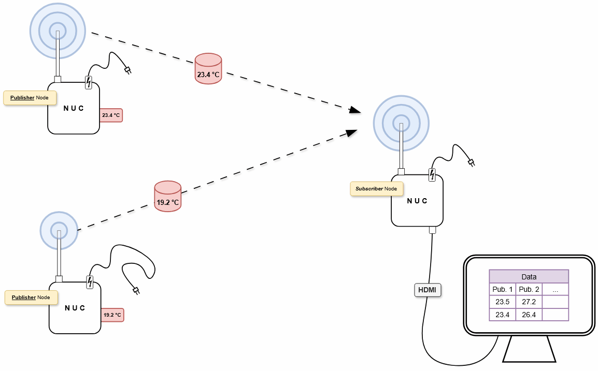
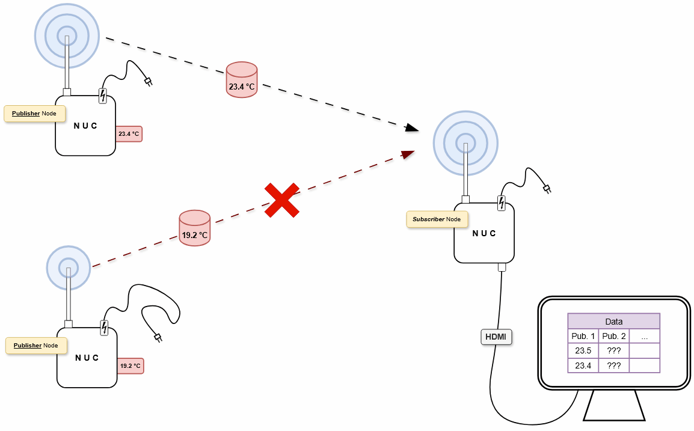

# Testszenarien
  

<table><tbody><tr><th colspan="2"><h2>Testaufbau 1</h2></th></tr><tr><td>
NUC-Publisher
</td><td>
<strong>NUC-Subscriber</strong>
</td></tr><tr><td colspan="2">
Komponenten
</td></tr><tr><td><ul><li>Publisher Node</li><li>Stromversorgung</li><li><em>Antenne</em></li><li><em>Sensor(en)</em></li></ul></td><td><ul><li>Publisher Node</li><li>Stromversorgung</li><li><em>Antenne</em></li></ul></td></tr><tr><td colspan="2">
Aufbau
</td></tr><tr><td>
Einzelner NUC, steht irgendwo stationär und misst eventuell Daten

Publisher für diese Messdaten (oder Testdaten)

Sollte theoretisch keinen Monitor brauchen, weil nur Daten gesendet werden sollen. Kann über den Subscriber getestet werden.
</td><td>
<strong>Einzelner </strong>NUC, soll neben dem <em>Publisher</em> aufgebaut sein

<strong>Subscriber </strong>für diese (Test-)Daten

Sollte mit Monitor verbunden sein, um Daten korrekt anzeigen zu können
</td></tr><tr><td colspan="2">
So kann die Verbindung zwischen einem Publisher und Subscriber getestet werden.

Sind nebeneinander aufgebaut, um keine Verbindungsabbrüche oder schwache Signale beachten zu müssen.

Es soll noch kein Abbrechen der Verbindung getestet werden.

Stabile Stromversorgung (Abbruch, s. o.)
</td></tr></tbody></table>
  

## **Testaufbau 2**

<table><tbody><tr><th>
NUC-Publisher 1
</th><th>
NUC-Publisher 2
</th><th>
NUC-Subscriber
</th></tr><tr><td colspan="3">
Komponenten
</td></tr><tr><td colspan="2"><ul><li>Publisher Node</li><li>Stromversorgung</li><li><em>Antenne</em></li><li><em>Sensor(en)</em></li></ul></td><td><ul><li>Publisher Node</li><li>Stromversorgung</li><li><em>Antenne</em></li></ul></td></tr><tr><td colspan="3">
Aufbau
</td></tr><tr><td colspan="2"><ul><li>Publisher von Daten</li><li>Kein Anschluss an Monitor</li><li>Stabile Stromversorgung</li><li>Bleibt in der Nähe des Subscribers</li></ul></td><td><ul><li><strong>Einzelner </strong>NUC, soll neben dem <em>Publisher</em> aufgebaut sein</li><li><strong>Subscriber </strong>für diese (Test-)Daten</li><li>Sollte mit Monitor verbunden sein, um Daten korrekt anzeigen zu können</li></ul></td></tr><tr><td colspan="3">
Testet, ob mehrere Publisher korrekt mit dem Subscriber interagieren können. Ansonsten gleicher Aufbau wie in <a href="#Testaufbau_1">Test-Aufbau 1</a>.

Beide Publisher bleiben in Reichweite vom Subscriber
</td></tr></tbody></table>
  

## **Testaufbau 3**

<table><tbody><tr><th>
NUC-Publisher 1
</th><th>
NUC-Publisher 2
</th><th>
NUC-Subscriber
</th></tr><tr><td colspan="3">
Komponenten
</td></tr><tr><td colspan="2"><ul><li>Publisher Node</li><li>Stromversorgung</li><li><em>Antenne</em></li><li><em>Sensor(en)</em></li></ul></td><td rowspan="2"><ul><li>Publisher Node</li><li>Stromversorgung</li><li><em>Antenne</em></li></ul></td></tr><tr><td></td><td><ul><li>Langes Stromkabel</li></ul></td></tr><tr><td colspan="3">
Aufbau
</td></tr><tr><td colspan="2"><ul><li>Publisher von Daten</li><li>Kein Anschluss an Monitor</li><li>Stabile Stromversorgung</li></ul></td><td rowspan="2"><ul><li><strong>Einzelner </strong>NUC, soll neben dem <em>Publisher</em> aufgebaut sein</li><li><strong>Subscriber </strong>für diese (Test-)Daten</li><li>Sollte mit Monitor verbunden sein, um Daten korrekt anzeigen zu können</li></ul></td></tr><tr><td><ul><li>Bleibt in der Nähe des Subscribers</li></ul></td><td><ul><li>In größerer Entfernung Aufbauen</li><li>Langes Stromkabel ermöglicht es, NUC zu bewegen</li><li>Alternativ: NUC ausschalten um Verbindungsverlust zu simulieren</li></ul></td></tr><tr><td colspan="3">
Testet, ob mehrere Publisher korrekt mit dem Subscriber interagieren können.

Der Aufbau unterscheidet sich darin, dass getestet werden soll, wie sich das System verhält, wen ein Publisher außerhalb der Reichweite des Subscribers ist (oder sich dorthin bewegt). Zum Beispiel: Baut sich die Verbindung wieder korrekt neu auf, wenn der Publisher in Reichweite kommt?

Voraussetzung ist, dass wir ein entsprechend Langes Kabel bekommen. Ansonsten werden die Stahlbeton-Wände im Labor wahrscheinlich auch ausreichen um das WLAN abzuschirmen.
</td></tr></tbody></table>
  
  

# Allgemeine Beschreibung

## Testaufbau 2
Zwei Publisher, beide senden durchgehend Daten. Subscriber verarbeitet beide.

## Testaufbau 3
Zwei Publisher, einer stoppt das Senden. Prüfen, ob alles funktioniert.

